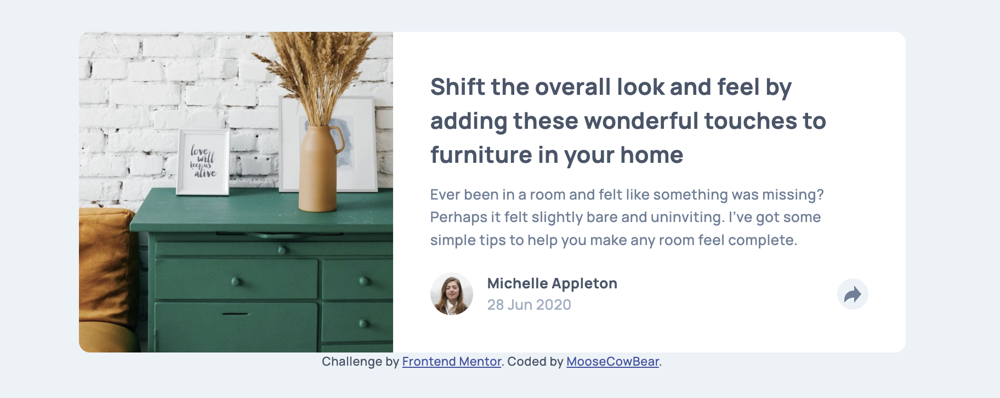
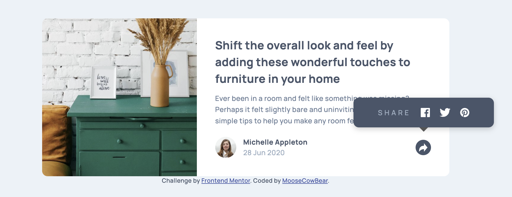

# Frontend Mentor - Article preview component solution

This is a solution to the [Article preview component challenge on Frontend Mentor](https://www.frontendmentor.io/challenges/article-preview-component-dYBN_pYFT).

## The challenge

Users should be able to:

- View the optimal layout for the component depending on their device's screen size
- See the social media share links when they click the share icon

## Screenshots

## Links

- [Solution](https://github.com/MooseCowBear/frontend-mentor-article-preview-component)
- [Live](https://moosecowbear.github.io/frontend-mentor-article-preview-component/)

## Built with

- CSS custom properties
- Flexbox

## Useful Resources

[This Stack Overflow on how to change the color of an image to white](https://stackoverflow.com/questions/52829623/how-to-make-a-color-white-using-filter-property-in-css)

## Author

- GitHub - [MooseCowBear](https://github.com/MooseCowBear)
- Frontend Mentor - [@MooseCowBear](https://www.frontendmentor.io/profile/MooseCowBear)

